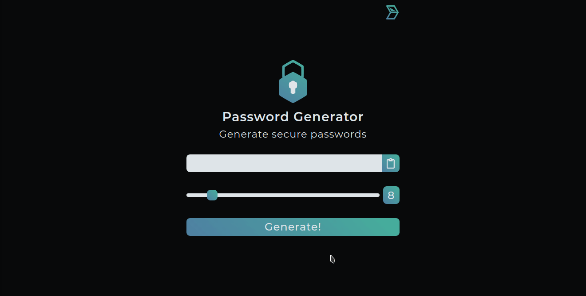

# 🔑 [Password Generator](https://darktechlc.github.io/passwordgenerator)

### Proteja suas contas com senhas fortes!

### Siga os seguintes passos para prevenir o acesso indevido à suas contas:

- Evite usar dados pessoais ou dados de fácil descoberta.

- Crie senhas que contenham no mínimo 8 caracteres, sendo eles maiúsculos, minúsculos, numéricos e simbólicos, e que tenham pouco ou nenhum relacionamento com suas informações.

- Use palavras-chave complexas nos serviços de autenticação e um gerenciador de senhas para organizá-las, nesse utilize uma senha mestra que seja complicada, mas fácil de ser memorizada.